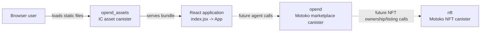

# OpenD: Architecture Design

OpenD is an Internet Computer (IC) NFT marketplace project. It is organized as a
React single-page frontend, two Motoko canisters, and an IC asset canister for
serving the built frontend.

> **Implementation status:** this document describes the repository as it is
> today. The canister and UI names establish the intended marketplace design,
> but marketplace operations, NFT state, and frontend-to-canister calls have not
> yet been implemented.

## System topology



`dfx.json` declares all three canisters. `opend_assets` depends on `opend`, so
DFX deploys the marketplace canister before the asset canister. The `nft`
canister is independently declared and has no configured dependency at present.

## Components

| Component | Technology | Responsibility today | Location |
| --- | --- | --- | --- |
| `opend_assets` | React 17, Webpack, IC asset canister | Bundles and serves the browser UI and static images/styles. | `src/opend_assets/` |
| `opend` | Motoko actor | Reserved marketplace backend boundary; the actor currently exposes no methods or persistent state. | `src/opend/main.mo` |
| `nft` | Motoko actor | Reserved NFT backend boundary; on installation it writes a deployment message to the canister log. | `src/NFT/nft.mo` |
| DFX configuration | DFX 0.9.3 | Defines canister names, types, frontend source paths, and the local replica network. | `dfx.json` |

## Frontend structure

```text
index.html
  └── index.jsx
        └── App.jsx
              ├── Header.jsx
              ├── home-img.png
              └── Footer.jsx

Unused by App today, but present as future UI building blocks:
  ├── Minter.jsx
  └── Gallery.jsx
        └── Item.jsx
```

The entry point renders `App` into `#root`. `App` only displays `Header`, the
home image, and `Footer`; its navigation buttons do not currently change views.
`Minter`, `Gallery`, and `Item` are static components and are not mounted by
`App`. The browser bundle imports `Principal` and creates the anonymous
principal (`2vxsx-fae`), but does not create an actor or call either backend.

## Build and deployment path

```text
React/JSX + CSS + image assets
        │ npm run build / npm start
        ▼
Webpack output: dist/opend_assets/
        │ dfx deploy
        ▼
opend_assets asset canister
        │ HTTP gateway / local replica
        ▼
Browser
```

Webpack uses `src/opend_assets/src/index.html` as its HTML template and writes
the bundle to `dist/opend_assets/`. Its canister-ID environment setup supports
local and IC deployments, but the current React code does not consume those
values. During development, the Webpack server proxies `/api` to the local DFX
replica on port 8000.

## Intended marketplace design

The legacy project notes (`task-execution.md`) describe the following desired
workflow. It is an architectural target, **not a current capability**.

1. A user mints an NFT and the marketplace records it in a collection such as
   `mapOfNFTs`.
2. The owner lists that NFT with a price and the marketplace records the listing
   in a collection such as `mapOfListings`.
3. Ownership is transferred to the marketplace canister while listed, implying
   an escrow model.
4. A token canister is used to settle payment when an NFT is bought.
5. The frontend’s Minter, Discover/Gallery, item, sell button, and price-input
   views call the marketplace and NFT actors through generated DFX declarations.

The intended dependency direction is:

```text
Browser UI -> opend marketplace -> NFT canister
                              -> token canister (not configured in this repo)
```

## Current gaps to close

- Define the NFT data model, ownership model, metadata/image-storage approach,
  and public Candid methods in `nft`.
- Implement minting, listing, purchase, authorization, and stable-state upgrade
  behavior in `opend`.
- Add the token canister declaration and settlement integration if token-based
  purchases are required.
- Generate/import DFX actor declarations and wire React actions and queries to
  those actors.
- Add routing or view state so the existing Header can expose Minter, Discover,
  and My NFTs screens.
- Add tests for ownership checks, escrow transitions, payment failures, and
  canister upgrades before treating the marketplace as production-ready.

## Local development

Install dependencies, start a local DFX replica, then run the frontend:

```bash
npm install
dfx start --clean
npm start
```

In a separate terminal, deploy the configured canisters:

```bash
dfx deploy
```

The frontend development server normally serves on `http://localhost:8080/`.
Use the URLs printed by DFX/Webpack if those ports are already occupied.
